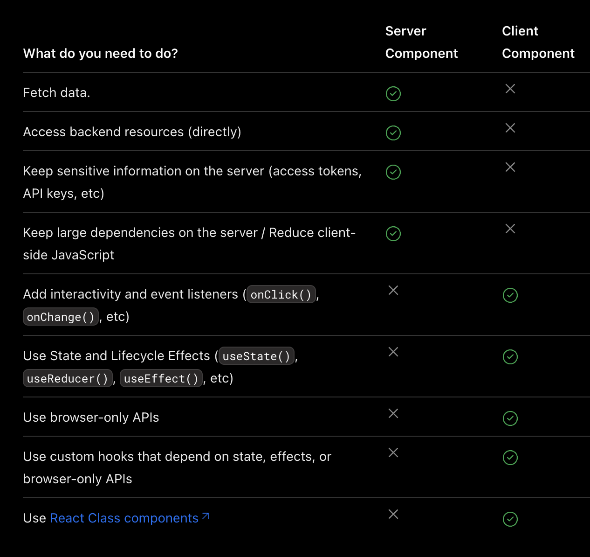
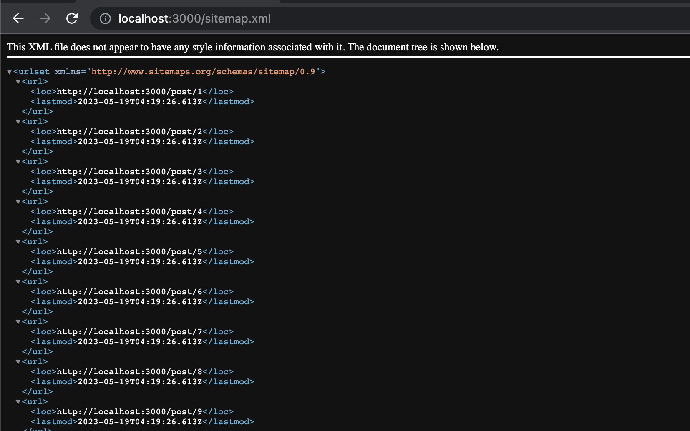
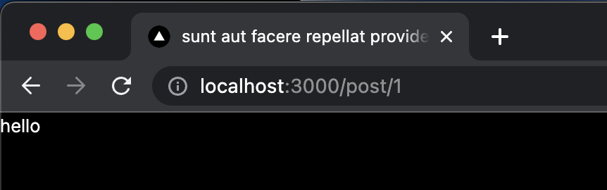

The Next.js app router has become stable and the recommended way to write modern full stack code. As such, this post will provide a walkthrough of what's new with the app router to effectively build modern web applications.

Announcement: https://nextjs.org/blog/next-13-4
Docs: https://nextjs.org/docs/getting-started/react-essentials

This post will cover:
* Routing: how do you create static and dynamic routes.
* Rendering: various  strategies can be chosen for each page to ensure optimal page speed and, consequently, the best user experience.
* SEO best practices: how can you get your website out there? There are a couple of super cool features Next.js has added to the app router that really allow you to push your website out there to new users through search engines.
* API routes: Next.js is a full stack framework and writing your own super fast API routes is a massive cornerstone of Next.js.

Table of Contents:
* 1. Routing, Server Components, Loading, Error Handling, Dynamic Routes
  * Routing
  * Server Components
  * Loading State
  * Error Handling
  * Dynamic Routes
    * Creating Dynamic Routes
    * Accessing Route Parameters
    * Get Request Parameters
    * Catch-all Segments
* 2. Rendering for Optimized Page Speeds
  * What Changed in Next.js 13?
  * Catch Management with Fetch API
  * Page-Level Control for Cache Management
  * Revalidating Cache and Generating Static Pages
  * Understanding Layouts in Next.js
* 3. SEO Best Practices & Optimization
  * Creating a Sitemap
  * Dynamic Metadata
  * Open Graph Images
* 4. Next.js 13 API Route Handlers
  * Creating API Endpoints
  * Handling HTTP Verbs
  * Handling Request and Response
  * Accessing Query Parameters and Request Body
  * Edge Runtime
* Conclusion

## 1. Routing, Server Components, Loading, Error Handling, Dynamic Routes
Routing is important because it defines the fundamental architecture of our applications like which pages can users can navigate to and what these pages contain.

Getting Started with NextJS 13.4:
1. Create new NextJS App
```bash
npx create-next-app@latest app-router
```
Use:
* TypeScript
* ESLint
* Tailwind
* src/ directory (not mandatory)

The initialization process will create an `app/` directory within `src/`. We can still use a `pages/` directory with nested file components for individual pages. This isn't necessary (and won't be used going forward), but is helpful for incremental adoption.

### Routing
The latest Next.js version has introduced a significant shift in the routing approach, transitioning from a file-based structure to a directory-based one. Each directory represents a route and contains a `page.tsx` file for the page content. Naming is crucial here, as Next.js relies on the `page.tsx` filename. To exclude a directory from the routing structure (for organizational purposes), you can wrap it in parentheses.

### Server Components
In Next.js 13.4, components default to being server components. This means their code runs on the server and is then sent to the client to render. Server components have no client-side footprint and can run code like data fetches at the top level. However, they can't use client-side APIs like React hooks. If you need these features, you must specifically declare the component to be a client component using the `'use client'` keyword.



In Next.js 13.4, we can mark server components as asynchronous and make database queries. For example, we can pull JSON placeholder text with the following:
```tsx
import axios from 'axios'

const page = async () => {
  const { data } = await axios.get('https://jsonplaceholder.typicode.com/posts/1')

  return <div>{JSON.stringify(data)}</div>
}

export default page
```

The component will make the request, then either log the response data or display it on the page. However, this raises an important question: how do we handle loading states?

### Loading State
To manage loading states for server components, you can create a `loading.tsx` file in the same directory as the `page.tsx` file. This file is displayed while the server component is being prepared. Once the server component is ready, Next.js swaps out the `loading.tsx` content for the `page.tsx` content.

These are the main concepts for understanding routing, server components, and loading states in Next.js 13.4. Remember, it's crucial to use the right filenames and directories for routing, and to be mindful of whether you're working with server or client components. The use of server components can greatly improve performance and user experience, as long as you handle loading states appropriately.

### Error Handling
Similar to the loading state, Next.js also has a way to handle errors in server components. Imagine if, for some reason, our API request fails. We would then face an unhandled error, with no way to catch it or show any fallback UI to our users.

To handle such a situation, Next.js 13.4 introduces another reserved file name that you can use, which is `error.tsx`.

If you create an `error.tsx` file in the same directory where the server component that might throw an error resides, Next.js will automatically use this file to show a fallback UI when an error occurs. This file would typically contain some sort of error message or a fallback UI to display when there is an error.

Here's an example of how you could use this feature:
1. Let's simulate an error in our server component. We could do this by throwing an error intentionally in the component's code.
```tsx
import axios from 'axios';

async function Page() {
  const { data } = await axios.get('https://jsonplaceholder.typicode.com/posts/1');

  throw new Error('something happened')

  return (<div>{JSON.stringify(data)}</div>);
}

export default Page;
```

2. Next, create a new file named `error.tsx` in the same directory as your server component.
```tsx
'use client'

const error = ({ error, reset }: { error: Error; reset: () => void }) => {
  return (
    <div>
      error <button onClick={reset}>Try again</button>
    </div>
  )
}

export default error
```

The error function returns an error object and reset function to redo the last action to see if this fixes the error. Since the error component is being passed a function implicitly (Next.js does this for us), Next.js requires this to be a client component with `use client`. In this above example, we are passing the reset function into the `onClick` handler of a button on screen. In this case, it is unnecessary since we know the error is about to happen, but if something just went wrong because an API that you rely on in your app had a short outage, this try again would work properly. We can use the `error` object to destructure the components of an error and display the error specific details to a user depending on which error is hit.

### Dynamic Routes
Dynamic routes enable your application to adapt its routes based on user interaction or specific conditions. For example, in a blog website, each post may have a unique URL derived from its ID or title. The approach to creating dynamic routes in Next.js is pretty similar to how we handle static routes.

**Creating Dynamic Routes**
Let's understand with an example.
1. First, we'll create a folder called `post` within `app` directory.
2. Inside the `post` folder, create a sub-folder named `[postId]` - the squared brackets (`[]`) indicate that this part of the route is dynamic.
3. Now, create a file within the `[postId]` folder named `page.tsx`. This file will hold the component that you want to render when the user navigates to `post/<postId>`.

Your file structure should look like this:
```plaintext
app/
  post/
    [postId]/
      page.tsx
```

Now, let's make a simple component in the `page.tsx` file to verify that everything is working:
```jsx
const PostPage = () => {
  return <div>Post Page</div>;
};

export default PostPage;
```

If you navigate to `/post/1` (or `/post/<any-value>`), the `PostPage` component will be rendered.

**Accessing Route Parameters**
You can access the value you input as `postId` in the URL within your page component. By default, `page.tsx` receives props. One of the props is `params` which contains `postId`. You can console log these props to see it for yourself:
```jsx
const PostPage = (props) => {
  console.log(props);
  return <div>Post Page</div>;
};

export default PostPage;
```

In the console log output (in the server), you'll see an object that looks something like this:
```plaintext
{
  params: {
    postId: '1'
  },
  searchParams: {}
}
```

The `postId` parameter can be used to fetch data related to the specific post.

To update the post being displayed on screen dynamically (in TypeScript):
```tsx
import { FC } from 'react'

interface PageProps {
  params: {
    postId: string
  }
}

const page: FC<PageProps> = (props) => {
  console.log(props)
  return <div>{props.params.postId}</div>
}

export default page

```

**GET Request Parameters**
In addition to route parameters, GET request parameters are also passed to the page. For example, if you navigate to `post/1?search=hello`, you'll find that in addition to the `params` object, a `searchParams` object is also passed:
```
{
  params: {
    postId: '1'
  },
  searchParams: {
    search: 'hello'
  }
}
```

This way, you can handle additional parameters passed via the URL.

**Catch-all Segments**
Sometimes, your application may require a deeper level of nesting in the URL, such as `/post/1/blue`. However, our current setup can't handle this additional level.

Next.js provides a solution for this in the form of catch-all segments. If we change our folder structure from `[postId]` to `[...postId]`, this `postId` becomes a catch-all segment.

Your new file structure should look like this:
```plaintext
pages/
  post/
    [...postId]/
      page.tsx
```

Now, if you navigate to `/post/1/blue`, you'll see that the `postId` prop in your component now receives an array of path segments:
```
{ params: { postId: [ '1', 'blue' ] }, searchParams: {} }
```

The catch-all segment maps to all the path segments that come after `/post/`, with each segment separated by a slash (`/`) being an element in the array.

Dynamic routes in Next.js allow you to create flexible paths that can adapt based on the user's interaction or specific conditions. This is especially useful in applications where content is dynamically generated, such as blog posts or product pages in an e-commerce site.

With the knowledge of creating dynamic routes, accessing route parameters, handling GET request parameers, and using catch-all segments, you can now build more complex and interactive applications with Next.js.

Remember that the key to dynamic routing lies in understanding the specific needs of your application and how users interact with it.

## 2. Rendering for Optimized Page Speeds
Rendering plays a vital role in application speed. The more static a page is, the faster it typically renders. Next.js 13 brings significant changes to routing and rendering, making the process more straitforward and efficient.

### What Changed in Next.js 13?
Previously in Next.js 12, a component would be turned into a server component by exporting an asynchronous function named `getServerSideProps`. The object returned as props in this function would then be passed as props into the component on the server and included in the HTML to be fetched on the client.

However, in Next.js 13, this approach no longer exists. The process is now fundamentally different - and simpler.

Let's illustrate this with an example. Consider we have a normal folder in the `app/` directory, `dashboard`, and a page `page.tsx`. This will map to a `/dashboard` URL and render the page as a component for this path.

To check how this is rendered, build out the application with `yarn build` or `npm run build`. These commands create a production-ready version of the application. For each path, the console will display how that path is rendered, which is extremely useful for understandin your application's performance.
```bash
yarn build
# or
npm run build
```

After the build process is complete, you can see how each path is rendered. For instance, let's look at our main `dashboard`. It will display the size of JavaScript is ships and the rendering strategy.

```plaintext
Route (app)                                Size     First Load JS
┌ ○ /                                      4.76 kB        81.7 kB
├ ○ /dashboard                             149 B          77.1 kB
└ λ /post/[...postId]                      148 B          77.1 kB

λ  (Server)  server-side renders at runtime
○  (Static)  automatically rendered as static HTML
```

For a static page without any database calls or other dynamic elements, Next.js will render it out statically at build time, making any request to this page incredibly fast because it's already statically generated.

For dynamic routes, such as the catch-all `postId` created earlier, these will naturally be dynamic. Database calls are made during their execution.

However, there are ways to convert these dynamic routes into static ones as well.

### Cache Management with Fetch API
The fetch API in Next.js 13 has been modified to specify caching behavior. Here is how you can use it:
```jsx
const page =async ({}) => {
  const res = await fetch('https://jsonplaceholder.typicode.com/posts/1', {
    cache: 'no-store'
  })

  const data = await res.json()

  return <div>{JSON.stringify(data)}</div>
}

export default page
```

Here, `cache: 'no-store'` is used to prevent caching, so every time the user requests this page, Next.js will make a request to the endpoint. Because we have opted out of the caching behavior, `/dashboard` turned into a dynamic route. This is what we want if we are specifying `cache: 'no-store'`.

If we re-reun `npm run build`, we see this in the output:
```
Route (app)                                Size     First Load JS
┌ ○ /                                      4.76 kB        81.7 kB
├ λ /dashboard                             149 B          77.1 kB
└ λ /post/[...postId]                      149 B          77.1 kB
```

For caching and revalidating data at certain intervals, you can use a strategy known as "Incremental Static Regeneration".

Here's how you can do that:
```tsx
const page = async ({}) => {
  const res = await fetch('https://jsonplaceholder.typicode.com/posts/1', {
    next: { revalidate: 10 }
  })

  const data = await res.json()

  return <div>{JSON.stringify(data)}</div>
}

export default page
```

In this example, the `revalidate: 10` parameter means that every 10 seconds, the cache is invalidated. However, up until those 10 seconds, it remains cached. This allows for a compromise between fully static and fully dynamic rendering.

We can re-run `npm run build` and observe the `/dashboard` path is now static:
```
Route (app)                                Size     First Load JS
┌ ○ /                                      4.76 kB        81.7 kB
├ ○ /dashboard                             149 B          77.1 kB
└ λ /post/[...postId]                      148 B          77.1 kB
```

Now, you may prefer other data-fetching libraries like Axios over the native fetch API, but unfortunately, Axios doesn't support these caching options. But don't worry, Next.js provides a solution for this as well.

### Page-Level Control for Cache Management
Even if you want to use other HTTP clients like Axios, you can control caching and revalidation at a per-page level in Next.js 13.

Here's how to do that:
```tsx
import axios from 'axios'

export const dynamic = 'force-dynamic'

const page = async ({}) => {
  const { data } = await axios.get('https://jsonplaceholder.typicode.com/posts/1')

  return <div>{JSON.stringify(data)}</div>
}

export default page
```

In the example above, the `dynamic` export forces the page to be rendered dynamically. When you build the application with `yarn build` or `npm run build` again, you'll see that the `/dashboard` route, which was previously a static route, has now turned into a dynamic route (represented by a lambda in the build output).
```
Route (app)                                Size     First Load JS
┌ ○ /                                      4.76 kB        81.7 kB
├ λ /dashboard                             149 B          77.1 kB
└ λ /post/[...postId]                      148 B          77.1 kB
```

This lambda indicates server-side rendering at runtime instead of at build time (like static rendering), which is the new equivalent of the `getServerSideProps` function in Next.js 12.

To summarize, Next.js 13 brings significant improvements to rendering and routing. These changes offer greater flexibility for your applications and more control over the page rendering strategies, enhancing the overall performance of your Next.js applications.

### Revalidating Cache and Generating Static Pages
In the previous section, we saw how to make a dynamic route in Next.js 13 that triggers a fetch request every time the page is requested. But Next.js also lets us incrementally invalidate the cache, a powerful feature that optimizes performance.

To do this, instead of using the `dynamic` export, we use `revalidate`. This method sets the default revalidation time for that layout or page. For instance, if you wanted the page to update every 10 seconds, you can set the revalidate time to 10. Note that if a different value is specified in your fetch requests, it will override the revalidation time specified in your page or layout.

```tsx
import axios from 'axios'

export const revalidate = 10

const page = async ({}) => {
  const { data } = await axios.get('https://jsonplaceholder.typicode.com/posts/1')

  return <div>{JSON.stringify(data)}</div>
}

export default page
```

When you rebuild the application, the rendering strategy of the page shifts. In the case of our dashboard page, it turns into a static page just like we would expect. This is beneficial as static pages perform better. They aren't requested at runtime, so the data doesn't need to be fetched then, which saves you from dealing with API latencies.

```
Route (app)                                Size     First Load JS
┌ ○ /                                      4.76 kB        81.7 kB
├ ○ /dashboard                             149 B          77.1 kB
└ λ /post/[...postId]                      148 B          77.1 kB
```

However, what if we wanted to turn our dynamic posts into static assets? This is very possible with Next.js, and here's how to do it:

Navigate to the page containing the dynamic path you wish to make static. To generate this route statically at build time, export an async function called `generateStaticParams`. Inside this function, return an array that contains a value for each post id specified in the angle brackets.

For example:
```jsx
export async function generateStaticParams() {
  const posts = ['post-one', 'post-two']

  return posts.map((post) => {
    return {
      postId: post
    }
  })
}

const page = async (props: any) => {
  return <div>hello</div>
}

export default page
```

Here, 'post-one' and 'post-two' are URL paths of all the posts in the application. When you build the application (`yarn build` or `npm run build`), this function will run for the dynamic route to get all the paths, turning it into a statically generated route.
```
Route (app)                                Size     First Load JS
┌ ○ /                                      4.76 kB        81.7 kB
├ ○ /dashboard                             149 B          77.1 kB
└ ● /post/[postId]                         149 B          77.1 kB
    ├ /post/post-one
    └ /post/post-two

○  (Static)  automatically rendered as static HTML (uses no initial props)
●  (SSG)     automatically generated as static HTML + JSON (uses getStaticProps)
```

This technique turns your page into a server-side generated (SSG) page, indicated by a filled out dot icon in the build output. This means that whatever data we get back from the posts is placed into JSON and passed into our static page whenever the user requests this resource. As a result, API calls aren't needed at runtime whenever the user enters the URL, making the pages faster to load.

### Understanding Layouts in Next.js

Next.js 13 allows you to control revalidation or dynamicness on a page or layout basis. So what is a layout? A layout is a reserved file type that acts as a wrapper for your application. The root layout is automatically server-rendered by default, and all pages of your application pass through this layout as children.

For example, if you have a dashboard page in your application (represented as `dashboard/page.tsx`), it would be passed as children into the root layout. By rendering the children in the layout, you ensure your application functions as expected.

However, the power of layouts lies in their ability to share state between rerenders. When something changes inside a component, causing a rerender, the layout maintains its state, which saves computing power.

You can also define a layout at any point in your application. This allows you to control which pages use which layouts. For instance, you could have a layout in the same folder as a `page.tsx` file, and that layout will only apply to that specific page. If the children (content of the page) aren't rendered in this layout, it won't affect the rest of the application, as this layout isn't above (in the file tree) the other pages.

There's also a similar feature called `template` which behaves similarly to `layout`. However, in most cases, you'll be dealing with layouts, as they offer extensive control over the rendering and rerouting of your Next.js application.

In this in-depth discussion, we have covered key topics like revalidating cache, statically generating pages, and the purpose of layouts in Next.js 13. All of these concepts are vital in understanding the flexibility and performance improvements that Next.js provides, making it a powerful framework for building web applications.

## 3. SEO Best Practices & Optimization
How can you make your site rank well in Google? What has changed in Next.js 13 that helps your site improve its SEO and get seen by real users on a search engine?

In Next.js 13, the coolest feature they've implemented for SEO purposes is generating sitemaps for your entire application at build time. This feature is incredibly powerful, and its implementation is straightforward.

### Creating a Sitemap
To get started, create a new file inside your `app/` directory named `sitemap.ts` (or `sitemap.js` if you're using JavaScript).
```tsx
export default async function sitemap() {
  // implementation here
}
```
The function `sitemap` will generate the sitemap. Whatever we return as an array in this function will end up in our sitemap.

For instance, let's say we have 100 posts on our website that we want to index in our sitemap. We can make a database call to fetch all the posts and then map over these posts.
```tsx
type Post = {
  userId: number
  id: number
  title: string
  body: string
}

export default async function sitemap() {
  const res = await fetch('https://jsonplaceholder.typicode.com/posts')
  const allPosts = (await res.json()) as Post[]

  const posts = allPosts.map((post) => ({
    url: `http://localhost:3000/post/${post.id}`,
    lastModified: new Date().toISOString()
  }))

  // implementation continues here
}
```

In this example, we've fetched posts from the JSON placeholder API and then used the map function to iterate over them. For each post, we've returned an object with a `url` and `lastModified`. The `url` is going to be `http://localhost:3000/post/${post.id}` to match our routing structure, which is `/post/{id}`.

However, we don't only have dynamic routes — we also have static routes. These can also be included in the sitemap. For instance, consider we have static routes like the homepage (`/`), an about page (`/about`), and a posts page (`/post`). We can map over these and add them to our sitemap.

```tsx
type Post = {
  userId: number
  id: number
  title: string
  body: string
}

export default async function sitemap() {
  const res = await fetch('https://jsonplaceholder.typicode.com/posts')
  const allPosts = (await res.json()) as Post[]

  const posts = allPosts.map((post) => ({
    url: `http://localhost:3000/post/${post.id}`,
    lastModified: new Date().toISOString()
  }))

  const routes = ['', '/about', '/post'].map((route) => ({
    url: `http://localhost:3000${route}`,
    lastModified: new Date().toISOString()
  }))

  return [...posts, ...routes]
}
```

In the code snippet above, we created an array of routes and then returned a new array that combines both our static routes and our dynamic post routes.

When you build your application by running `npm run build` or `yarn build`, Next.js will generate the whole sitemap for everything that you specified in your static routes and your dynamic posts. This makes it easier for SEO crawler bots to index all the pages on your site.

Navigate to `http://localhost:3000/sitemap.xml` in your browser to see the sitemap in action.



### Dynamic Metadata
After dynamic routes and static routes, let's explore another important aspect of SEO - _Dynamic Metadata_. We can define metadata dynamically based on the route parameters. For example, in a blogging site, the title of the post can be used as the page title for SEO. This helps each page in your site to have a unique title based on the content, which improves the SEO ranking of your pages.

Next.js provides a convenient method for managing dynamic metadata. We will use the `generateMetadata` function to generate metadata for a page based on the route parameters. Below is the code to create dynamic metadata for a blogging website where each post has a unique id:
```tsx
import { Metadata } from 'next'

interface PageProps {
  params: {
    postId: string
  }
}

type Post = {
  userId: number
  id: number
  title: string
  body: string
}

export async function generateMetadata({ params }: PageProps): Promise<Metadata> {
  const res = await fetch(`https://jsonplaceholder.typicode.com/posts/${params.postId}`)
  const data = (await res.json()) as Post
  return { title: data.title }
}

const page = async ({ params }: PageProps) => {
  return <div>hello</div>
}

export default page

```

In this code:
* `PageProps` is a TypeScript interface defining the expected structure of `params`.
* The `generateMetadata` function fetches a post from a dummy API based on the post id present in `params`.
* It then returns an object containing the title of the post, which is used as the metadata for that page.

You can check the page title in the browser tab when you navigate to different posts. The title should change to match the title of the post you're currently viewing. This is a great example of dynamic metadata. If you navigate to another post, the page title changes to match the title of the new post. This ensures each page has unique metadata, which significantly aids in SEO.



### Open Graph Images

Open Graph Protocol is a powerful tool that boosts the SEO of your website and enhances its sharing capabilitieson social media platforms. It enables any webpage to become a rich object in a social media post. An important feature of this protocol is the ability to specify Open Graph images, which are displayed when someone shares a link to your website.

For the vast majority of applications, you can simply use a static approach to set an Open Graph image. Place an image (PNG or JPEG) inside your root directory and name it `opengraph-image`. This image will be automatically used by Next.js as the Open Graph image for your website.
```bash
root-directory/
    └── opengraph-image.png
```
While you can set this image on a per-route basis, it's perfectly acceptable to set one for the entire application, especially when you're just getting started.

For those who need to define Open Graph images dynamically, an OpenGraphImage.tsx file can be created to generate the image. But bear in mind, this is usually beyond the scope of most applications and is not typically needed.

By leveraging Open Graph images, you can greatly enhance the visibility and attractiveness of your site's links on social media platforms, thereby improving your website's SEO.

## 4. Next.js 13 API Route Handlers
In Next.js 13, the approach for handling API routes has changed dramatically from the earlier versions. Next.js, as a full-stack framework, enables us to write our own API endpoints. Understanding these changes is crucial for efficient and effective development.

In this section, we'll delve into the major changes and show you how to write API endpoints in Next.js 13.

### Creating API Endpoints
To get started, within your `app/` directory, you can create an `api` folder (if it doesn't exist already), which will be your root for handling API endpoints.
```bash
root-directory/
    └── app/
        └── api/
```
You may choose to put your APIs anywhere, but the conventional practice is to place them in the `api` directory. Subsequently, the name of your file will be your actual API endpoint. Similar to the routing logic, the name of the file in the `api` folder will reflect in your API's URL.

For example, if you create a new file named `user/route.ts` within the `api` folder, the API endpoint will be at `/api/user`. The new naming convention to note here is that the API file should be called `route.ts`.

### Handling HTTP Verbs
With Next.js 13, each HTTP verb can have its own handler. This means you can export different functions for each HTTP verb (like GET, POST, PUT, DELETE, etc.) directly from the `route.ts` file.
```ts
export async function GET() {
  console.log('GET REQUEST')
}

export async function POST() {
  console.log('POST REQUEST')
}
```

In the above code, if a GET request is made to `/api/user`, the `get` function will handle it. Similarly, if a POST request is made, the `post` function will handle it.

You can test this in your console by running the following to call a GET or POST requests:
```bash
curl http://localhost:3000/api/user
# or
curl -X POST http://localhost:3000/api/user
```

### Handling Request and Response
An important concept to understand is how to handle request and response data in your handlers. The only argument received by your handler is the `request`, which can be typed either as `Request` (a built-in type) or `NextRequest` (a type provided by Next.js).

The way to send a response has also changed. In Next.js 13, instead of using `res.status(200).json()`, you would return a new instance of the `Response` class.

```ts
import { NextRequest } from 'next/server'

export async function GET(req: NextRequest) {
  console.log('GET REQUEST')

  return new Response(JSON.stringify({ name: 'alice' }), {
    status: 401
  })
}

export async function POST() {
  console.log('POST REQUEST')
}
```

The `Response` constructor takes two arguments: the body of the response and an optional `init` object which can contain properties like `headers`, `status`, and `statusText`.

### Accessing Query Parameters and Request Body
For GET requests, to access the search parameters (query parameters), you can use the `URL` and `URLSearchParams` interfaces.

For POST requests, to access the request body, you can use the `json` method of the `Request` object.

An example of a query with search parameters would be:
```bash
curl http://localhost:3000/api/user?mysearchparam=hello
```

Here is the updated `route.ts`:
```ts
import { NextRequest } from 'next/server'

export async function GET(req: NextRequest) {
  const { searchParams } = new URL(req.url)
  const mysearchparam = searchParams.get('mysearchparam')
  console.log(mysearchparam)

  return new Response(JSON.stringify({ name: 'alice' }), {
    status: 401
  })
}

export async function POST(req: NextRequest) {
  const body = await req.json()

  return new Response('OK')
}
```

### Edge Runtime
Next.js 13 also allows you to specify the runtime environment for your functions by exporting a `runtime` constant from your route file. You can set the runtime to edge, which can result in faster function execution but with the trade-off of limited API access.
```js
export const runtime = 'edge';
```

If you're using a technology like Prisma, which is not compatible with the Edge runtime, you may not be able to perform operations like fetching or writing to the database due to the limited API access.

For a more in-depth look into what APIs are accessible within the Edge runtime, you can refer to the [Next.js Documentation](https://nextjs.org/docs).

## Conclusion
By now, we've covered the fundamental changes in Next.js 13 concerning rendering, routing, SEO best practices, and API route handling. This update in Next.js brings us closer to modern full-stack web development standards and practices, emphasizing developer efficiency and ease of use.

In this post, we've looked at how to define API endpoints, handle different HTTP methods, manipulate request and response data, access search parameters and request body data, and utilize the Edge runtime for faster performance.

These changes not only improve the performance of your application but also enhance your code's clarity and maintainability, making it easier for you and others to understand your application's flow.

Embracing these changes will help in developing efficient and modern full-stack web applications using Next.js.
